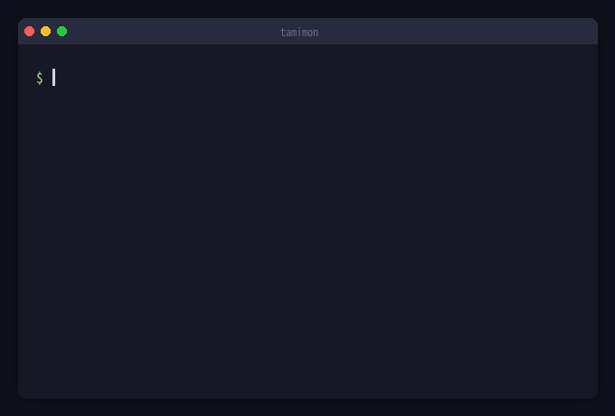

# Tamimon

**Terminal Monster** — ターミナル上で動作するRust製育成放置ゲーム

<div align="center">
  
</div>

## 機能

- 4段階の進化システム
- 合計120種以上のユニークASCIIアート
- 図鑑に育てたモンスターを記録
- セーブデータは `~/.tamimon/save.json` に保存されます

## インストール

### クイックインストール（macOS / Linux）

```bash
curl -sSL https://raw.githubusercontent.com/usagi-f/tamimon/main/install.sh | sh
```

インストール先を変更する場合：

```bash
TAMIMON_INSTALL_DIR=~/.local/bin curl -sSL https://raw.githubusercontent.com/usagi-f/tamimon/main/install.sh | sh
```

### ソースからビルド（Rust環境が必要）

```bash
cargo install --git https://github.com/usagi-f/tamimon.git
```

### バイナリダウンロード

[Releases](https://github.com/usagi-f/tamimon/releases) ページから各プラットフォーム向けビルド済みバイナリをダウンロードできます：

| プラットフォーム | バイナリ |
|--------------|--------|
| Linux (x86_64) | `tamimon-x86_64-unknown-linux-gnu` |
| macOS (Intel) | `tamimon-x86_64-apple-darwin` |
| macOS (Apple Silicon) | `tamimon-aarch64-apple-darwin` |

## 遊び方

```bash
tamimon
```

初回起動時に名前を決めます。約1時間後に孵化してTamimonが生まれます。

### アクション

| キー | アクション | 効果 |
|-----|----------|------|
| `T` | 話しかける | なかよし度・きもちUP |
| `P` | あそぶ | きもち・げんきUP |
| `R` | 特訓 | げんきUP・体重ダウン |
| `E` | まったり | きもちUP・体重アップ |
| `A` | 図鑑 | Tamimonコレクションを見る |
| `Q` | 終了 | セーブして終了 |

## 対応環境

- macOS（Intel / Apple Silicon）
- Linux（x86_64）

## 開発

```bash
git clone https://github.com/usagi-f/tamimon.git
cd tamimon
cargo run
```

テスト実行：

```bash
cargo test
```

## ライセンス

MIT
